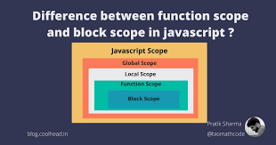
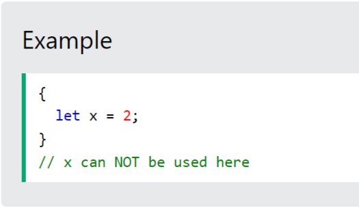
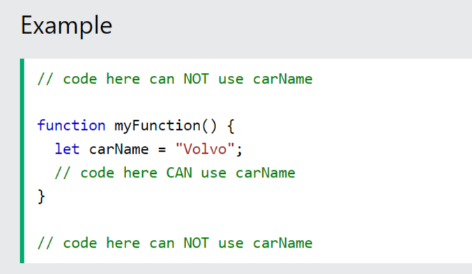
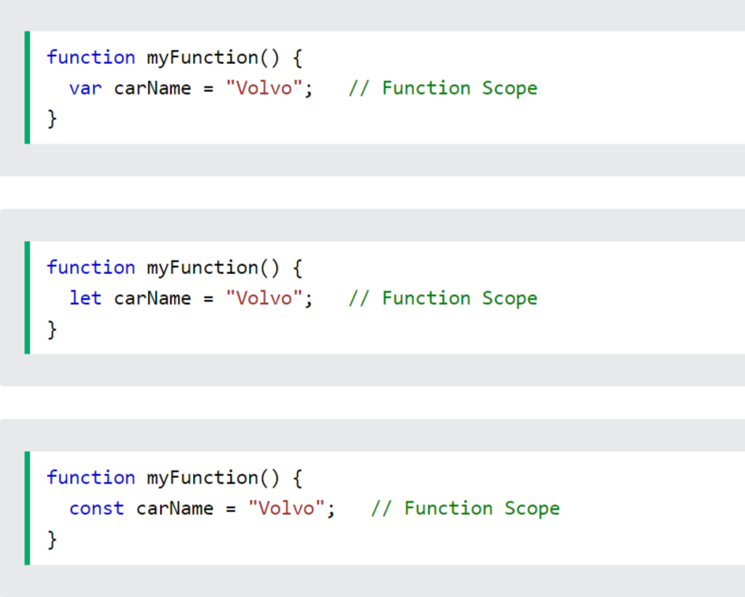
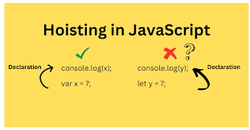
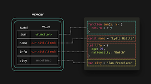
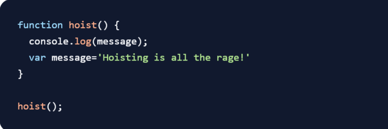
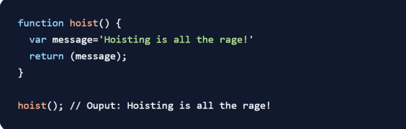

# Scope
#### Предварительное условие: понимание области видимости Javascript , подъема Javascript.

#### В JavaScript существует два типа областей видимости.

#### Глобальная область: область действия за пределами самой внешней функции, прикрепленной к окну.
#### Локальная область: внутри выполняемой функции.

# Block Scope

#### Before ES6 (2015), JavaScript had only Global Scope and Function Scope.ES6 introduced two important new JavaScript keywords: let and const.

#### These two keywords provide Block Scope in JavaScript.Variables declared inside a { } block cannot be accessed from outside the block:

# Local Scope

#### Variables declared within a JavaScript function, become LOCAL to the function.

#### Since local variables are only recognized inside their functions, variables with the same name can be used in different functions. Local variables are created when a function starts, and deleted when the function is completed.

# Function Scope

#### JavaScript has function scope: Each function creates a new scope.Variables defined inside a function are not accessible (visible) from outside the function.Variables declared with var, let and const are quite similar when declared inside a function.

### They all have Function Scope:

# Hoisting 

#### In this tutorial, we’ll investigate how the famed hoisting mechanism occurs in JavaScript. Before we dive in, let’s get to grips with what hoisting is.Hoisting is a JavaScript mechanism where variables and function declarations are moved to the top of their scope before code execution.Inevitably, this means that no matter where functions and variables are declared, they are moved to the top of their scope regardless of whether their scope is global or local.

#### Of note however, is the fact that the hoisting mechanism only moves the declaration. The assignments are left in place.If you’ve ever wondered why you were able to call functions before you wrote them in your code, then read on!

### To demonstrate this behaviour, have a look at the following:

### To avoid this pitfall, we would make sure to declare and initialise the variable before we use it:

